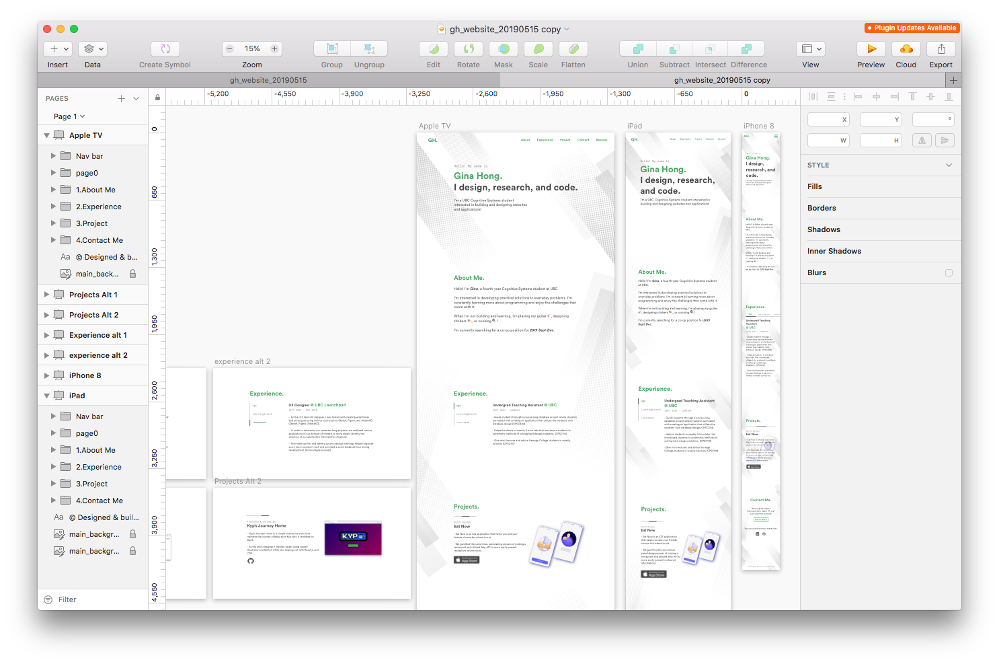

Currently learning Gatsby.js! I'm learning it so I can update my website.

Here's a wip picture:

## What I'm learning

1. Basic commands/organization of project
2. Creating pages
3. Using Graphql basics
4. Adding blog posts
